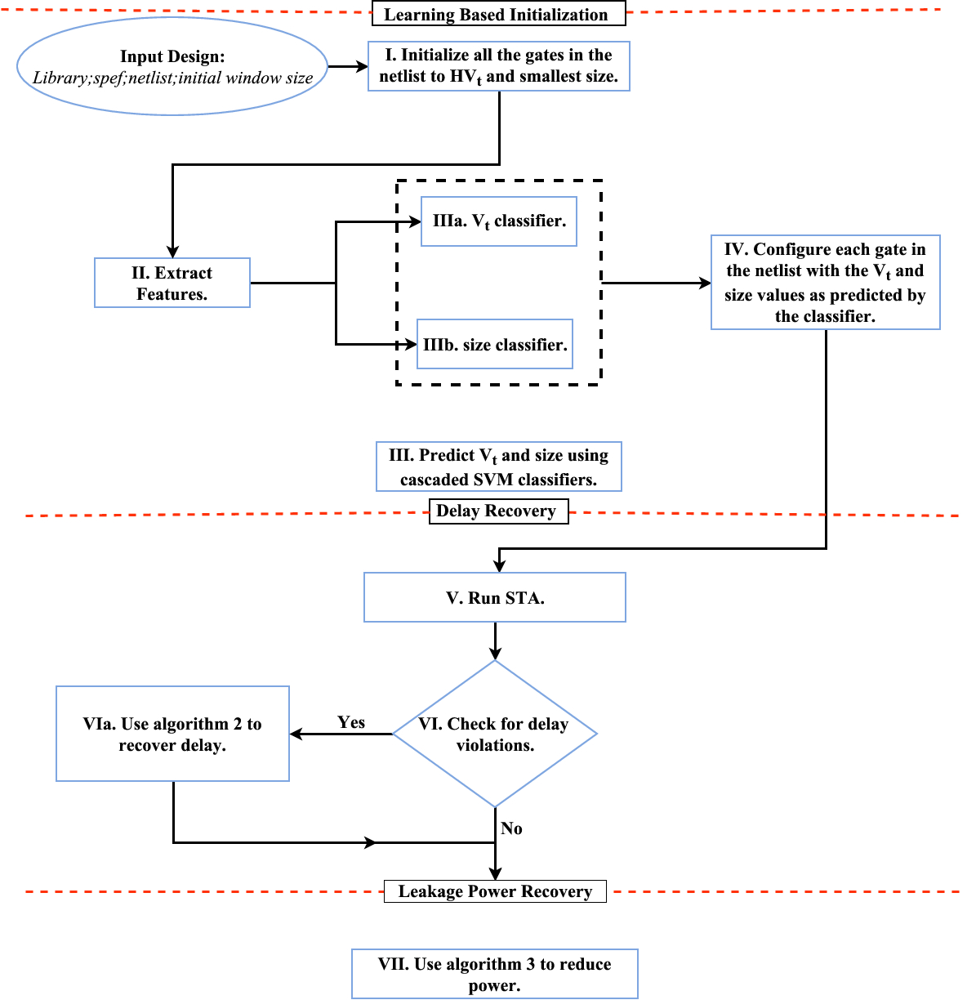
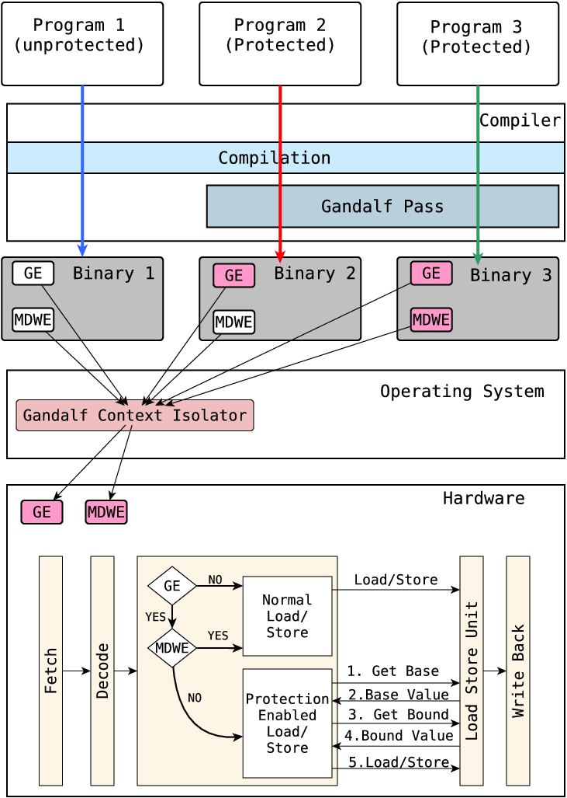
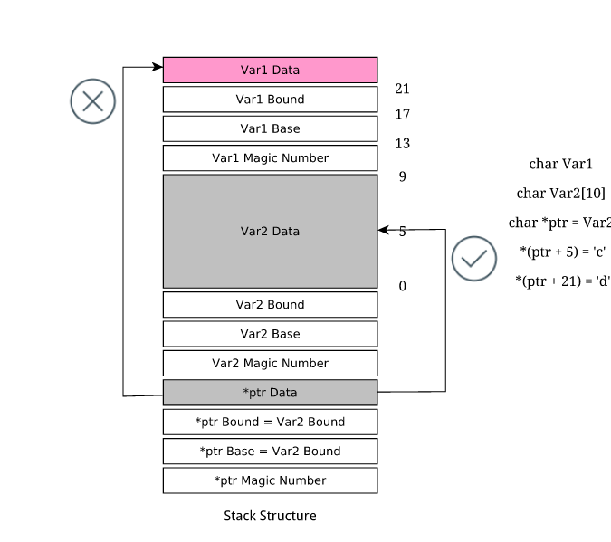
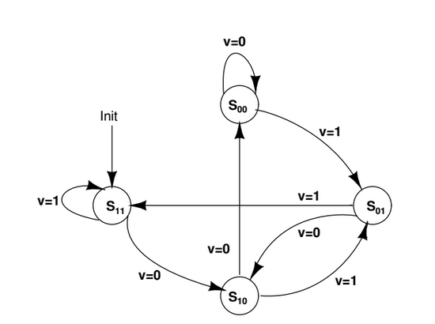
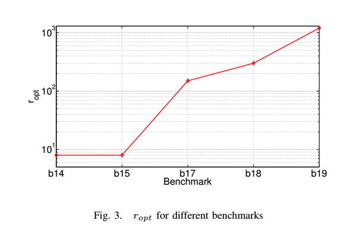
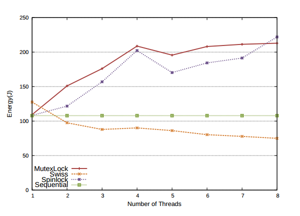

<head>
  <title>Patanjali</title>
</head>
# About Me

Am currently pursuing my PhD at IIT Madras. My primary area of interest is in developing energy efficient systems. I have also worked on a couple of problems in hardware security.

I am currently working on the following three problems
<ul>
<li> Developing smarter backend tools for VLSI-CAD.</li>
<li> Building accelerators for Machine Learning </li>
<li> Building secure systems </li> 
</ul>

I have also worked on developing heuristics for various post synthesis stages like partitioning,placement and routing, as a part of my course projects. My other areas of interest include  Computer Architecture and Parallel Algorithms.

# Awards
<ul>
   <li> <a href="https://www.iitm.ac.in/content/iitm-team-wins-first-place-csaw-embedded-security-challenge-2016-%E0%A4%86%E0%A4%88%E0%A4%86%E0%A4%88%E0%A4%9F%E0%A5%80%E0%A4%8F%E0%A4%AE-%E0%A4%9F%E0%A5%80%E0%A4%AE-%E0%A4%B8%E0%A5%80%E0%A4%8F%E0%A4%B8%E0%A4%8F%E0%A4%A1%E0%A4%AC%E0%A5%8D%E0%A4%B2%E0%A5%8D%E0%A4%AF%E0%A5%82">  Won 1st place in Embedded Security Challenge in Cyber Security Awareness Week, 2016 </a></li>
   <li> <a href = "http://www.skipser.com/p/2/p/hacku-2013-winners.html"> Won 2nd place in Yahoo, Hackathon, 2013 </a> </li>
   </ul>
# Publications:

<ul> 
  <li> <table width="100%" align="center" border="0" cellspacing="0">
   <tr text-align="justify"><h3>"MLTimer: Leakage Power Minimisation in Digital Circuits using Machine Learning and Adaptive Lazy Timing Analysis</h3><h5><i><b> To be published in JOLPE June 2018 </b></i></h5>
   <h5> Patanjali SLPSK, Milan Patnaik, Seetal Potluri, Kamakoti Veezhinathan</h5></tr>
    <tr>
      <td width="30%">
               
      </td>
      <td valign="top" width="70%"> 
        
 <h6>The timing constrained discrete sizing technique (TC-DSP) is employed at all stages of the physical synthesis flow and has been studied extensively over the last 30 years. The ISPD gate
sizing contests introduced industry standard benchmarks and library which motivated a lot of research in this area. However most of the solutions employed were either sensitivity driven or based on analytical methods that required incremental timing analysis after every iteration with both consuming a significant amount of time to perform the optimization. The key observations reported in this paper are i) there exists a good correlation between the slack distribution among gates in a given iteration and the order of gate replacements in subsequent iterations; and, ii) across the benchmark circuits there exists significant overlap in the number of sub-circuits that have similar structures. This paper exploits the above observations to propose MLTimer, an iterative algorithm that uses adaptive lazy timing analysis in conjunction with a Support Vector Machine (SVM) engine for solving the TC-DSP quickly and efficiently. We observe that for large benchmark circuits (≥ 200,000) our proposed solution reduces the leakage power by 3% and the running time by over 50% when compared to the best reported heuristic in the literature. This significant decrease in running time is very useful to the industry for achieving timing and power closures of large designs within a given deadline.</h6>
</td></tr>
        </table> </li>
  
  <li> <table width="100%" align="center" border="0" cellspacing="0">
   <tr text-align="justify"><a href="https://ieeexplore.ieee.org/document/8290931/"><h3>GANDALF: A fine-grained hardware-software co-design for preventing memory attacks</h3></a><h5><i><b>  Embedded Systems Letters, 2018 </b></i></h5>
   <h5> Gnanambikai Krishnakumar, Patanjali SLPSK, Prasanna Karthik Vairam, Chester Rebeiro</h5></tr>
    <tr>
      <td width="30%">
               
      </td>
      <td valign="top" width="70%"> 
        
 <h6>Illegal memory accesses are a serious security vulnerability that have been exploited on numerous occasions. In this paper we present Gandalf, a compiler assisted hardware extension for the OpenRISC processor that thwarts all forms of memory based attacks. We associate lightweight capabilities to all program variables, which are checked at run time by the hardware. Gandalf is transparent to the user and does not require significant OS modifications. Moreover, it achieves locality and incurs minimal overheads in the hardware. We demonstrate these features with a customized Linux kernel executing SPEC2006 benchmarks. To the best of our knowledge, this is the first work to demonstrate the complete solution for hardware based memory protection schemes for embedded platforms. </h6>
</td></tr>
        </table> </li>

<li> <table width="100%" align="center" border="0" cellspacing="0">
   <tr text-align="justify"><a href="https://arxiv.org/abs/1702.07223"><h3>GANDALF: A fine-grained hardware-software co-design for preventing memory attacks</h3></a><h5><i><b> (This is the work we submitted to CSAW2016) arXiv, 2017 </b></i></h5>
   <h5> Gnanambikai Krishnakumar, Patanjali SLPSK, Prasanna Karthik Vairam, Chester Rebeiro</h5></tr>
    <tr>
      <td width="30%">
               
      </td>
      <td valign="top" width="70%"> 
        
 <h6>Reading or writing outside the bounds of a buffer is a serious security vulnerability that has been exploited in numerous occasions. These attacks can be prevented by ensuring that every buffer is only accessed within its specified bounds. In this paper we present Gandalf, a compiler-assisted hardware extension for the OpenRISC processor that thwarts all forms of memory based attacks including buffer overflows and over-reads.The feature associates lightweight base and bound capabilities to all pointer variables, which are checked at run time by the hardware. Gandalf is transparent to the user and does not require significant OS modifications. Moreover, it achieves locality, thus resulting in small performance penalties. </h6>
</td></tr>
        </table> </li>
   <li>
   <table width="100%" align="center" border="0" cellspacing="0">
   <tr text-align="justify"><h3>HALTimer: a fast Vt replacement Heuristic for leakage power minimization using Adaptive Lazy Timer</h3><h5><i><b>  Design Automation Conference, 2015 (Work in progress) </b></i></h5>
   <h5>Patanjali SLPSK, Seetal Potluri and V. Kamakoti</h5></tr>
    <tr>
      <td width="30%">
               
      </td>
      <td valign="top" width="70%"> 
        
 <h6>Abstract—The discrete Vt sizing technique is employed at all stages of the physical synthesis flow, because it does not impact the placement yet provides significant room for power/timing optimization. The timing-constrained discrete Vt sizing problem (TC-DVSP) is NP-complete and earlier techniques reported for the same, employed iterative greedy or sensitivity-driven heuristics, that required incremental timing analysis after every   iteration. The key observation reported in this paper is that there exists a good correlation between the slack distribution among gates in a given iteration and the order of gate replacements in subsequent iterations. This paper exploits the above observation to propose HALTimer, an iterative algorithm that uses adaptive lazy timing analysis to solve the TC-DVSP. For large ISPD and ITC circuits, HALTimer reduces the running time from several days to a few hours. This significant decrease in running time is very useful to the industry for achieving timing and power closures of large designs within a given
deadline. </h6>
</td></tr>
</table></li>
 
   <li><table width="100%" align="center" border="0" cellspacing="0">
   <tr text-align="justify"><h3>Efficient Vt-Assignment to Minimize Circuit Leakage using Adaptive Lazy Timing Analysis</h3><h5><i><b>  Design Automation Conference, 2014 (Work in progress) </b></i></h5>
   <h5> Patanjali SLPSK, Seetal Potluri and V. Kamakoti</h5></tr>
    <tr>
      <td width="30%">
               
      </td>
      <td valign="top" width="70%"> 
        
 <h6>We consider the timing-constrained discrete Vt-assignment problem for leakage minimization in digital circuits. The problem is known to be NP-complete. Greedy or Sensitivity-driven heuristics are known to be very effective for iterative Vt-assignment, with incremental timing analysis performed between the iterations. These heuristics, while offering good leakage power savings, carry a huge run-time penalty with increase in circuit size.

In iterative Vt-assignment, we observe that there is a good correlation between the slack distribution in a given iteration, and the order of gate replacements in subsequent iterations. This paper proposes an algorithm, which exploits this high correlation to speed up the Vt-assignment process. The proposed algorithm uses gate replacement windows, with lazy timing evaluation, to reduce the total number of incremental STA runs during the optimization. At the end of each iteration, the successive window size is dynamically scaled up/down based on the timing updates at the end of the current window. The proposed algorithm, when applied to ISCAS/ITC circuits, significantly reduced the run-time without impacting the solution quality.
. </h6>
</td></tr>
   </table></li>
   <li><table>
   <tr text-align="justify"><a href="https://www.usenix.org/conference/hotpower12/workshop-program/presentation/gautham"><h3>The Implications of Shared Data Synchronization Techniques on Multi-Core Energy Efficiency</h3></a><h5><i><b> HotPower, 2012 </b></i></h5>
   <h5> Ashok Gautham, Kunal Korgaonkar, Patanjali SLPSK, Shankar Balachandran, and Kamakoti Veezhinathan</h5>

   </tr>
    <tr>
      <td width="30%">
               
      </td>
      <td valign="top" width="70%"> 
        
 <h6> Shared data synchronization is at the heart of the multi-core revolution since it is essential for writing concurrent programs. Ideally, a synchronization technique should be able to fully exploit the available cores, leading to improved performance. However, with the growing demand for energy-efficient systems, it also needs to work within the energy and power budget of the system. In this paper, we perform a detailed study of the performance as well as energy efficiency of popular shared-data synchronization techniques on a commodity multi-core processor. We show that Software Transactional Memory (STM) systems can perform better than locks for workloads where a significant portion of the running time is spent in the critical sections. We also show how power-conserving techniques available on modern processors like C-states and clock frequency scaling impact energy consumption and performance. Finally, we compare the performance of STMs and locks under similar power budgets. </h6>
</td></tr>
   </table></li>
   </ul>

# Internship
### IBM Labs (July, 2015 - December,2015)
<h2>Problem Statement </h2>
 

   In a typical design flow, multiple tools and scripts are used. Each tool reads the input,
 its associated constraints, processes and generates data as output. At present there is no
 mechanism to represent this data in a database which limits the possibility of live query on
 the data and get a useful information and value add out of it. For example: to find a timing
 critical path it requires to load a timer which in turn processes the input and eventually
 writes out report. Instead, it can be easily queried if the database is annotated with relevant
 information. The project addresses the following:

 
   <ul>
   <li> Using Graph based data base representation like Neo4J/MongoDB </li>
   <li> Handle Hierarchical design data </li>
   <li> Distribution over multiple clusters (as design is developed over multiple sites and multiple people and partitioned)  </li>
   <li> Extensible as data can be annotated with any information on top of the base structure.</li>
   <li> Common and useful queries as value added service.</li>
   </ul>

# Academic Details
I have completed my B.Tech from Pondicherry Engineering College, Pondicherry in Electrical, Electronics and Communications Engineering in 2011.

# Contact:
slpskp [at] cse [dot] iitm [dot] cse [dot] in
